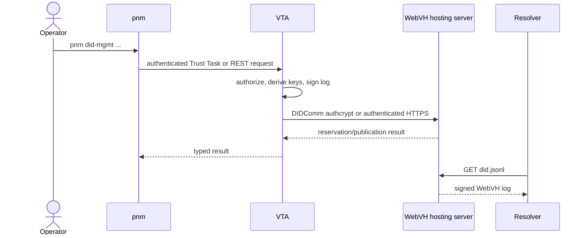

# DID Management and WebVH Hosting with PNM

This guide explains how an operator uses `pnm` to create and manage
`did:webvh` identities through a Verifiable Trust Agent (VTA), and how the VTA
publishes those identities through a registered WebVH hosting server. It covers
the complete online lifecycle: server registration, domain discovery, DID
creation, inspection, editing, promotion from serverless operation, agent
names, and deletion.

For initial VTA and PNM installation, start with [Cold-start](cold-start.md).
For the WebVH log and key-rotation model, see
[DID:WebVH update](did-webvh-update.md).

## Mental model

There are three distinct actors:

- **PNM** is the authenticated operator CLI. It does not hold the managed
  DID's private keys and does not publish `did.jsonl` itself.
- **VTA** is the controller and key authority. It derives or imports keys,
  signs WebVH log entries, stores DID state, enforces context authorization,
  and coordinates publication.
- **WebVH hosting server** is the publication backplane. It reserves paths,
  serves `did.jsonl`, and may provide tenant domains and human-readable agent
  names. It does not become the DID's key authority.



The two network legs select transport independently:

1. **PNM to VTA:** `--transport auto` prefers TSP, then DIDComm, then REST.
   A forced transport fails rather than silently falling back. Use
   `--transport rest` as the recovery path when a mediator is unavailable.
2. **VTA to WebVH host:** the VTA resolves the registered server DID. It uses
   `DIDCommMessaging` when advertised; otherwise it uses the URL in a
   `WebVHHosting` service. `WebVHHostingService` is accepted as a legacy
   read-only alias. Service matching is by `type`, not by the service `id`.

The VTA-to-host leg does not currently use TSP. A TSP-capable PNM session can
therefore invoke a DID operation whose publication leg uses DIDComm or HTTPS.

## Command map

The current operator-facing hierarchy is `pnm did-mgmt`; the older
`pnm webvh` spelling is retired.

| Goal | Command |
| --- | --- |
| Register and maintain hosting backplanes | `pnm did-mgmt servers ...` |
| Create, inspect, edit, publish, and delete DIDs | `pnm did-mgmt dids ...` |
| Bind human-readable names to hosted DIDs | `pnm did-mgmt agent-names ...` |
| Manage reusable DID-document shapes | `pnm did-templates ...` |
| Change services advertised by the VTA's own DID | `pnm services ...` |
| Provision an integration | `pnm bootstrap provision-integration ...` |

`did-mgmt servers` configures where the VTA can publish. `pnm services`
changes the service entries in the VTA's own DID document. These are different
operations even when the VTA's own DID is the DID being published.

Useful global options are:

```bash
# Select a configured VTA by slug.
pnm --vta personal did-mgmt servers list

# Override the configured REST URL.
pnm --url https://vta.example did-mgmt servers list

# Pin the PNM-to-VTA transport.
pnm --transport rest did-mgmt dids list

# Stable machine-readable list output.
pnm --json did-mgmt dids list

# Do not truncate identifiers in table output.
pnm --full-display did-mgmt dids list
```

`PNM_VTA` and `VTA_URL` are the environment-variable equivalents of `--vta`
and `--url`.

## Prerequisites

Before managing DIDs, verify the following:

1. The VTA is set up and running, and PNM has completed its binding to it.
2. The VTA has its own DID and corresponding signing key. The VTA uses this
   identity to authenticate to a hosting server.
3. The target context exists. Use `pnm contexts list` to inspect contexts.
4. The PNM principal has the required role and context scope.
5. For hosted operation, the hosting server has granted the **VTA DID** an ACL
   entry. The host authenticates the VTA, not the human PNM operator.
6. The hosting server DID resolves and advertises `DIDCommMessaging` or
   `WebVHHosting`.

Most DID mutations require an administrator who can act in the DID's context.
Hosting-server registration and serverless-to-hosted promotion require a
super-admin. Read operations remain context-filtered; an authenticated caller
does not gain visibility into unrelated contexts.

Run command-specific help against the installed binary when scripting:

```bash
pnm did-mgmt --help
pnm did-mgmt dids create --help
pnm did-mgmt dids edit --help
```

## Register a hosting server

The VTA registry maps a short, operator-chosen ID such as `prod` to a hosting
server DID. The ID is local VTA configuration; it is not a domain name or DID.

```bash
pnm did-mgmt servers add \
  --id prod \
  --did did:web:webvh.example.com \
  --label "Production WebVH"
```

On registration, the VTA resolves the DID and verifies that it advertises a
supported hosting transport. Registration does not test every future publish,
because endpoint resolution and authentication happen lazily when used.

The hosting server must authorize the VTA DID. For HTTPS hosts, the first
operation performs a challenge-response authentication using the VTA's
Ed25519 key and caches short-lived access/refresh tokens. A host-side `403`
normally means that the signature was valid but the VTA DID is not in the
host's ACL. For DIDComm hosts, authcrypt authenticates the sender intrinsically.

List registered servers:

```bash
pnm did-mgmt servers list
pnm --full-display did-mgmt servers list
```

Change only the local display label:

```bash
pnm did-mgmt servers update prod --label "Primary host"
pnm did-mgmt servers update prod --label ""  # clear the label
```

An existing server ID cannot be silently repointed to another DID. Repointing
would redirect every managed DID that references it and requires an explicit
migration instead.

Remove a registry entry:

```bash
pnm did-mgmt servers remove prod
```

Removal deletes the VTA's server metadata and cached host credentials. It does
**not** migrate or delete DIDs that reference that server. Move or retire those
DIDs first; otherwise later updates cannot find their publication server.

## Discover hosting domains

A hosting backplane may serve multiple tenant domains. Ask the host for the
domains available to the VTA DID:

```bash
pnm did-mgmt dids list-domains --server prod
```

The response is caller-scoped by the host's ACL. It can include the host's
system default, labels, and disabled domains. The host resolves an omitted
domain in this order:

1. The VTA DID's ACL default on the host.
2. The host's system default.
3. Reject with `did-management:unknown_domain` if neither exists.

When an interactive `create` or `register` targets a server with multiple
domains and omits `--domain`, PNM offers a selection prompt. Non-TTY calls skip
the prompt and use the host's default chain, so automation should always pass
`--domain` when the target must be deterministic.

Domain discovery is currently available only through a host's REST control
plane. A DIDComm-only host returns an empty list and still allows create or
register to proceed using the host's default resolution chain.

## Create a hosted DID

The minimal hosted flow lets the server assign a path:

```bash
pnm did-mgmt dids create \
  --context personal \
  --server prod
```

A deterministic tenant and path can be selected explicitly:

```bash
pnm did-mgmt dids create \
  --context personal \
  --server prod \
  --domain identities.example.com \
  --path alice \
  --label "Alice primary DID" \
  --pre-rotation 2
```

Hosted path behavior is:

| `--path` value | Behavior |
| --- | --- |
| Omitted or blank | Host allocates a path; this is the default |
| `.well-known` | Request the root slot; generally host-admin gated |
| Any other value | Request that explicit path |

Creation proceeds as follows:

1. The VTA authorizes the caller against `--context`.
2. The VTA asks the host to reserve or allocate the path.
3. The VTA derives or loads the requested keys.
4. The VTA constructs and signs the genesis WebVH log entry.
5. The VTA publishes the log and persists the DID record, key handles, and
   confirmed host version.

Important create options:

| Option | Meaning |
| --- | --- |
| `--context <id>` | Required context that owns the DID |
| `--server <id>` | Registered host; mutually exclusive with `--did-url` |
| `--domain <name>` | Explicit tenant domain on the selected host |
| `--path <path>` | Host path selection described above |
| `--label <text>` | Operator label; defaults internally to the context ID |
| `--portable <bool>` | Portable DID flag; defaults to `true` |
| `--pre-rotation <n>` | Future update-key commitments; defaults to `0` |
| `--mediator-service` | Add the configured DIDComm mediator service |
| `--services '<json-array>'` | Add arbitrary service entries |
| `--no-primary` | Do not make this the context's primary DID |
| `--signing-key <id>` | Reuse an existing Ed25519 key |
| `--ka-key <id>` | Reuse an existing X25519 key; requires `--signing-key` |

If the document contains a DIDComm service, a key-agreement key is required.
The `Mnemonic` printed for a hosted DID is the host-issued slot/path handle,
not the VTA's BIP-39 master-seed mnemonic. Avoid exposing it unnecessarily
because the VTA uses it in later host control-plane calls.

### Template-backed creation

Prefer a stored DID template when the document must follow a reusable shape:

```bash
pnm did-mgmt dids create \
  --context personal \
  --server prod \
  --template did-host-http \
  --var URL=https://identities.example.com
```

Use `pnm did-templates show <name>` to inspect required variables before
creating. `--var KEY=VALUE` is repeatable and supplies string values. Template
resolution is context scope, then global scope, then built-in. By default,
`--context` is also used as the template lookup context; override it with
`--template-context`.

`--template` is mutually exclusive with `--did-document` and `--did-log`.
See [DID templates](did-templates.md) for canonical built-in names, reserved
variables, validation, and custom templates. Retired `webvh-*` and
`did-hosting-*` template names do not resolve.

### Advanced document inputs

`--did-document <file>` supplies a JSON document shape for the VTA to complete
and sign. `--did-log <file>` supplies an already-signed final log and is
serverless-only. These modes are intended for specialized integrations;
templates are safer for repeatable operator workflows.

When existing keys are selected, `--ka-key` requires `--signing-key`. The VTA
also validates that service and key types are consistent before committing the
new DID.

## Create a serverless DID

Serverless mode means the VTA controls and stores the signed log but has no
registered host to publish it. Supply the public URL where you will place the
log instead of `--server`:

```bash
pnm did-mgmt dids create \
  --context personal \
  --did-url https://identity.example/alice \
  --no-primary
```

Exactly one of `--server` and `--did-url` is required. The VTA stores the DID
with `server_id = "serverless"` and prints the generated `did.jsonl`. Deploy
that log at the URL corresponding to the DID. Future updates remain local, so
fetch and redeploy the complete log after every change:

```bash
pnm did-mgmt dids get-log "$DID" --out did.jsonl
```

Serverless does not mean `did:key`, and it does not mean that the VTA serves the
log automatically. It specifically means a locally managed `did:webvh` log
without a registered publication backplane.

## Inspect DIDs and logs

List every DID visible to the current principal, or filter by context/server:

```bash
pnm did-mgmt dids list
pnm did-mgmt dids list --context personal
pnm did-mgmt dids list --server prod
```

The VTA filters results using the caller's context scope. An empty result does
not prove that no other contexts contain DIDs.

Inspect one local VTA record:

```bash
pnm did-mgmt dids get "$DID"
```

Retrieve the complete raw log:

```bash
pnm did-mgmt dids get-log "$DID"
pnm did-mgmt dids get-log "$DID" --out did.jsonl
```

`get-log` reads the VTA's stored snapshot; it is not a live resolver query.
Use it for audit, debugging, backup publication, or serverless redeployment.
The VTA also exposes public WebVH logs to resolvers at `GET /did/{did}/log`,
while PNM uses the authenticated transport-independent SDK path so it also
works over TSP or DIDComm sessions.

## Edit a DID document

The common workflow opens the current document in `$EDITOR` or `$VISUAL`:

```bash
pnm did-mgmt dids edit --did "$DID"
```

PNM displays a document diff, optionally prompts for WebVH parameters, asks for
confirmation, and publishes a new log entry. Interactive mode records the
fetched `versionId`; if another operator updates the DID while the editor is
open, the VTA returns a conflict instead of overwriting the newer change.

The DID document's top-level `id` is immutable. To use a different DID
identifier, create another DID.

For unattended document updates:

```bash
pnm did-mgmt dids edit \
  --did "$DID" \
  --document updated-did.json \
  --pre-rotation 2 \
  --ttl 86400 \
  --watcher https://watcher.example/log \
  --label "post-audit update" \
  --no-confirm
```

Replace watchers with repeated `--watcher` flags, or disable them:

```bash
pnm did-mgmt dids edit \
  --did "$DID" \
  --no-watchers \
  --no-confirm
```

For witnesses, explicit optimistic concurrency, or the complete wire shape,
pass `--options-file` containing an `UpdateDidWebvhBody`:

```json
{
  "document": {
    "id": "did:webvh:..."
  },
  "preRotationCount": 2,
  "watchers": ["https://watcher.example/log"],
  "ttl": 86400,
  "label": "automated update",
  "expectedVersionId": "4-zQm..."
}
```

The wire form is camelCase. The sample document is abbreviated; a real
replacement must be a valid complete DID document with the unchanged `id`.
When `--options-file` is present, it supplies the whole request body and any
per-field edit flags are ignored; do not combine the two forms.

Replacing the DID document rotates the WebVH update key and refreshes any
pre-rotation commitments. Metadata-only changes such as TTL, watchers, or a
label do not rotate the update key unless the pre-rotation setting itself
requires a key change. There is currently no separate
`pnm did-mgmt dids rotate-keys` command, although the SDK/VTA have a lower-level
rotation operation. Use `edit` for the supported PNM workflow and see
[DID:WebVH update](did-webvh-update.md) for cryptographic details.

Hosted updates are published automatically. Serverless updates are stored
locally and PNM prints a reminder to export and redeploy `did.jsonl`.

If a hosted publish fails after local update state was persisted, the VTA keeps
the pending local head. The next update reconciles that unpublished head before
creating another version. Do not hand-edit the host copy to work around a
failed publish; fix connectivity or authorization and retry through the VTA.

## Promote a serverless DID to hosted operation

When a host becomes available later, publish the existing log without changing
the DID identifier:

```bash
pnm did-mgmt dids register \
  --did "$DID" \
  --server prod \
  --domain identities.example.com
```

Promotion requires super-admin authority and performs an atomic claim and
publish on the host. Only after the host accepts the complete local log does
the VTA change the local record from `serverless` to the selected server and
record the host-issued path mnemonic. Future DID edits and relevant
`pnm services` mutations then auto-publish.

The operation refuses DIDs that are already server-managed. Moving a DID from
one host to another needs coordinated teardown and is intentionally not hidden
inside this command.

`--force` asks the host to replace a slot owned by a different DID and is
honored only when the VTA DID has host-admin authority:

```bash
pnm did-mgmt dids register \
  --did "$DID" \
  --server prod \
  --force
```

Owner re-registration of the same slot is idempotent and does not require
`--force`.

## Manage agent names

An agent name is a human-readable `domain/@name` bound to a hosted DID. The
domain is derived from the DID; the operator supplies only the local name.
Names must be 2-63 lowercase alphanumeric or hyphen characters, with an
alphanumeric first and last character.

Check availability, then bind a name:

```bash
pnm did-mgmt agent-names check --did "$DID" --name ops
pnm did-mgmt agent-names set --did "$DID" --name ops
```

`check` is advisory because another caller can claim the name before `set`.
The host rejects reserved and already-taken names during the atomic bind.

Binding updates the DID document's `alsoKnownAs`, signs and publishes a new
WebVH version, and updates the host's name registry in one operation. The host
serves `/@ops` as a redirect only while the signed DID document claims that
name. This prevents an unsigned registry entry from authorizing a binding.

List names, including parked names:

```bash
pnm did-mgmt agent-names list --did "$DID"
```

Temporarily stop resolution while retaining the reservation:

```bash
pnm did-mgmt agent-names disable --did "$DID" --name ops
pnm did-mgmt agent-names enable --did "$DID" --name ops
```

Release the reservation entirely:

```bash
pnm did-mgmt agent-names remove --did "$DID" --name ops
```

Agent names require a server-managed DID. They are unavailable for serverless
DIDs because no hosting control plane can reserve or serve the name. Read
operations require access to the DID's context; mutations use the same
context-admin update path as a normal DID edit.

To display names beside DIDs in supported list commands, opt into network
verification:

```bash
pnm --resolve-agent-names did-mgmt dids list
```

PNM trusts a displayed name only when resolving the name leads back to the DID
that claims it. This costs additional resolution and fetch requests.

## Delete a DID

```bash
pnm did-mgmt dids delete "$DID"
```

Deletion requires admin authority in the DID's context. For a hosted DID, the
VTA first asks the hosting server to remove or soft-delete the slot, then
removes its local DID record and best-effort key records. For a serverless DID,
only local state is removed; remove the externally deployed `did.jsonl`
yourself if appropriate.

Remote host cleanup is best-effort and local deletion proceeds even if the
host cannot be reached. The current PNM response does not expose the remote
cleanup warning, so verify host state separately when deletion occurs during a
host outage. Treat deletion as destructive: use `get-log --out` first when an
audit or recovery copy is required.

## Permissions

| Operation | VTA authorization |
| --- | --- |
| List registered servers or available domains | Any authenticated principal |
| Add, relabel, or remove a server | Super-admin |
| Create a DID | Admin with access to the target context |
| List DIDs | Authenticated; results filtered by context scope |
| Get a DID or its stored log | Access to that DID's context |
| Edit or delete a DID | Admin with access to that DID's context |
| Promote a serverless DID | Super-admin |
| List/check agent names | Access to that DID's context |
| Mutate an agent name | Admin with access to that DID's context |

The hosting server performs a second authorization decision based on the VTA
DID. A PNM caller can therefore pass VTA authorization and still receive a
host-side denial for a domain, path, name, or admin-only takeover.

## Publication and security behavior

### HTTPS host authentication

For `WebVHHosting`, the endpoint URL must be HTTPS except for loopback
development addresses. The client refuses non-loopback plaintext HTTP before
sending credentials or signatures. Requests use bounded connect/request
timeouts. Access and refresh tokens are stored separately from public server
metadata and are not returned by `servers list` or included in backup data.

The VTA serializes token refresh per server to prevent concurrent refresh-token
rotation races. A mid-session `401` invalidates cached credentials,
reauthenticates, and retries once.

### DIDComm host authentication

For `DIDCommMessaging`, the VTA uses authcrypt requests. Sender authentication,
recipient binding, and encryption come from DIDComm rather than a custom
signature header. Host problem reports are mapped back to typed VTA errors so
validation, authorization, and conflict statuses reach PNM.

### Local state

The VTA stores server metadata, host tokens, DID records, raw logs, and the
last host-confirmed version in separate records in the WebVH keyspace. Private
keys remain in the VTA key hierarchy/secret backend; the hosting server gets
signed public logs, not those private keys.

## Offline VTA commands

Non-TEE deployments expose an offline `vta did-mgmt ...` surface for direct
local access, including server registry operations and the core DID lifecycle.
It is not identical to the online PNM surface. Stop the daemon first because
the fjall database lock is the local safety boundary:

```bash
vta did-mgmt dids edit --did "$DID"
vta did-mgmt dids register --did "$DID" --server prod
```

Offline commands use filesystem access rather than a PNM authentication
ceremony. They are unavailable for TEE deployments because the parent process
cannot directly open enclave storage. Use authenticated `pnm` commands against
the running enclave instead.

## Troubleshooting

### PNM has no active VTA

Select a configured VTA with `--vta <slug>` or complete `pnm setup`. If setup
is pending, finish it with the corresponding `pnm setup continue` flow.

### Server DID does not resolve

`servers add` resolves the supplied DID immediately. Confirm the DID is
published through the configured resolver and that its document advertises
`DIDCommMessaging` or `WebVHHosting`. The service `type`, not a fragment such
as `#didcomm` or `#webvh`, controls selection.

### Host authentication returns 403

Grant the VTA DID an ACL entry on the hosting server. Granting the PNM
operator's DID is not sufficient because the VTA makes the publication call.

### No domains are listed

The VTA DID may have no host-side domain grant, or the host may be DIDComm-only
and therefore unable to expose the REST-only discovery operation. Try create
without `--domain` only when a caller/system default is known to exist.

### `did-management:unknown_domain`

Run `pnm did-mgmt dids list-domains --server <id>` and select an active domain
visible to the VTA DID. In CI, pass it explicitly.

### Path or name conflict

Choose another `--path` or agent name. `--force` applies only to
serverless-DID promotion by a host admin; it is not a general create override.

### A serverless edit is not visible to resolvers

Export the complete current log and redeploy it:

```bash
pnm did-mgmt dids get-log "$DID" --out did.jsonl
```

### Interactive edit reports a version conflict

Another operation updated the DID after PNM fetched it. Re-run `edit`, reapply
the intended change to the new document, and publish again. Do not remove the
`expectedVersionId` guard merely to overwrite the concurrent update.

### Mediator transport is unavailable

This may affect either network leg. To recover the PNM-to-VTA leg, force REST:

```bash
pnm --transport rest did-mgmt dids list
```

If the registered host DID selects DIDComm, forcing PNM to REST does not change
the VTA-to-host leg. Restore the host's DIDComm service or register a correctly
advertised HTTPS-capable host.

### Server registry entry was removed too early

DIDs still retain the removed server ID and cannot auto-publish. Do not reuse
that ID for a different server. Restore the original registration or perform a
coordinated migration outside the simple server CRUD commands.

## REST and Trust Task surfaces

PNM normally calls the transport-independent SDK. REST sessions use these VTA
routes; TSP/DIDComm sessions carry the corresponding Trust Tasks.

| Operation | VTA REST route |
| --- | --- |
| Add server | `POST /webvh/servers` |
| List servers | `GET /webvh/servers` |
| Update server label | `PATCH /webvh/servers/{id}` |
| Remove server | `DELETE /webvh/servers/{id}` |
| List host domains | `GET /webvh/servers/{id}/domains` |
| Create DID | `POST /webvh/dids` |
| List DIDs | `GET /webvh/dids` |
| Get DID | `GET /webvh/dids/{did}` |
| Get stored log | `GET /webvh/dids/{did}/log` |
| Public resolver log | `GET /did/{did}/log` |
| Delete DID | `DELETE /webvh/dids/{did}` |
| Promote serverless DID | `POST /webvh/dids/{did}/register-server` |

The VTA's HTTPS client uses the hosting server's `/api/auth/*`, `/api/dids/*`,
`/api/me/domains`, and `/api/agent-names/*` control-plane routes. The exact host
route is an implementation detail discovered through the server DID; operators
should invoke it through PNM/VTA rather than scripting host bearer tokens.

## Implementation map

The primary implementation entry points are:

- PNM hierarchy and flags: `pnm-cli/src/cli.rs`
- PNM dispatch and domain prompting: `pnm-cli/src/commands/webvh.rs`
- Shared rendering and edit workflow: `vta-cli-common/src/commands/webvh.rs`
  and `vta-cli-common/src/commands/webvh_edit.rs`
- Agent-name CLI behavior: `vta-cli-common/src/commands/agent_names.rs`
- SDK client: `vta-sdk/src/client/webvh.rs`
- Wire types: `vta-sdk/src/protocols/did_management/`
- VTA HTTP routes: `vta-service/src/routes/did_webvh.rs`
- VTA orchestration: `vta-service/src/operations/did_webvh/`
- Host transport selection: `vta-service/src/operations/did_webvh/transport.rs`
- HTTPS host client: `vta-webvh/src/webvh_client.rs`
- DIDComm host bridge: `vta-service/src/webvh_didcomm.rs`
- VTA WebVH persistence: `vta-webvh/src/webvh_store.rs`

## Related guides

- [Cold-start](cold-start.md)
- [Non-interactive setup](non-interactive-setup.md)
- [DID templates](did-templates.md)
- [Provision-integration](provision-integration.md)
- [DID:WebVH update](did-webvh-update.md)
- [Runtime service management](runtime-service-management.md)
- [TSP](tsp.md)
- [Seal and unseal](seal-and-unseal.md)
